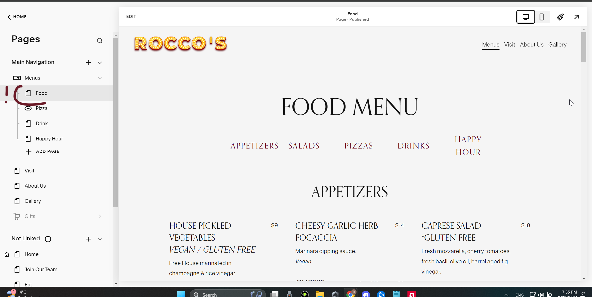
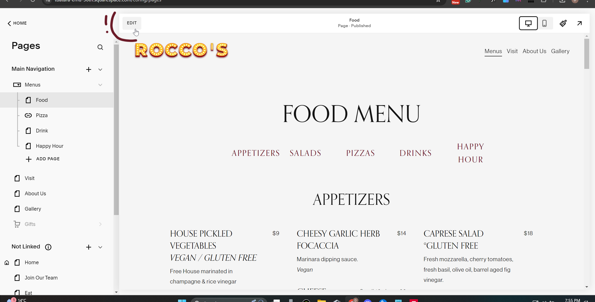
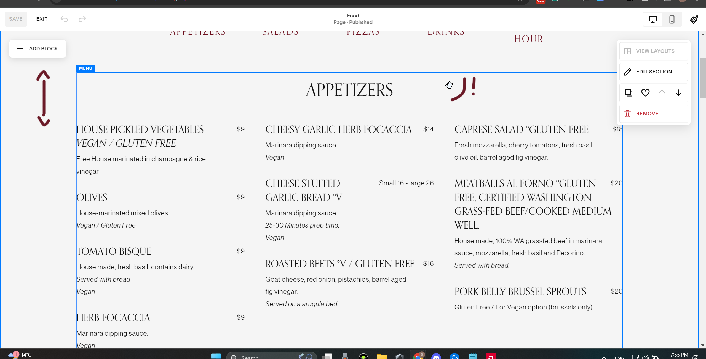
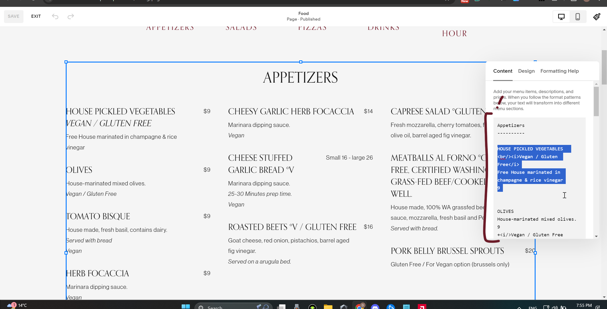
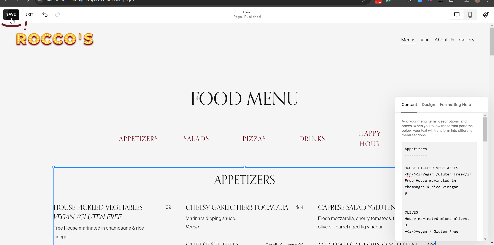
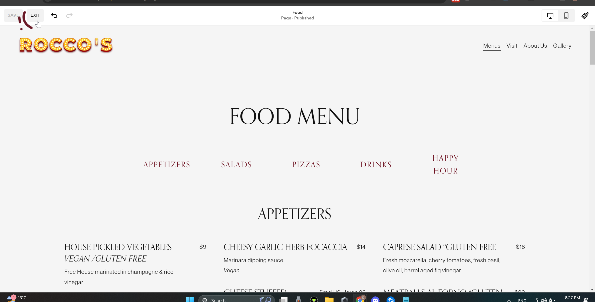
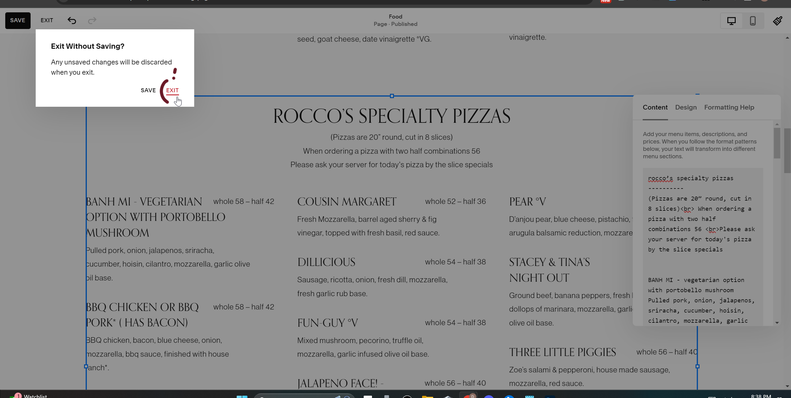

****1. Accessing Squarespace****
Open Your Browser: Use Google Chrome, Firefox, or Safari for best results.

Go to Squarespace Website:
squarespace.com

Login to Your Account:
Click the Login button (top right).

Enter your email and password, then click Sign In.

****2. Navigating the Squarespace Dashboard****
Access the Dashboard:
Once logged in, you'll see the Squarespace Dashboard. This is where you manage your website.

Select Your Website:
Select the website you want to work on from the dashboard list.

**3. Editing a Restaurant Menu on Squarespace**

**Step 1: Locating the Menu Page**

Go to Pages:
On the left side of the dashboard, find and click on Pages.

Find Your Menu Page:
In the Page Menu, look for your restaurant's menu page (it might be named something like "Menu" or "Food & Drink").
Click on the menu page to open it.

**Step 2: Editing the Menu**
Enable Page Edit Mode:
Navigate to your Menu Page and click Edit on the top left.

**Step 3: Editing the content**
Edit Text:
Scroll to the section where you would like to make changes and then double-click on the text area where the menu is displayed (menu items and prices).

The window on the right will pop up.

**Step 4: Saving Your Changes**
Save the Page:
Once you've made your changes and _all looks good_, click Save (top left) and then Exit (top left).

Your changes are now live on the website.

If you accidentally deleted something, click exit. It will ask you if you want to exit without saving, click exit under that message.

Go to Your Live Website:
Open a new tab and type in your website’s URL (e.g., www.yourrestaurant.com).

5. Viewing Your Updated Menu

**Troubleshooting Tips**

_I Can’t Find the Edit Button:_
Make sure you're logged in to Squarespace and that you are viewing the correct page. Check the top left for the Edit button.

_Changes Not Showing:_
Ensure you've clicked Save after editing. Sometimes, refreshing your browser will help you see the changes.

_Accidentally Deleted Something:_
Don't panic! If you made a mistake, click Exit instead of Save and don't save changes.

_Accidentally Deleted Part of the menu code and saved:_
Don't panic! If you made a mistake in any section of the menu below is the link to the folder with menu sections saved:
https://github.com/milya1/Roccos/tree/main/menu%20repository

There are 4 files for the main menu page:
appetizers and salads - first block
rocco's specialty pizza - second block (right after salads)
build your own table - a short code with price/topping table contents (keep in mind that this block formatting looks different from other blocks)
desserts and soft drinks - the last block on the page

_If you're stuck or something isn’t working:_
Visit Squarespace Help Center:
Go to help.squarespace.com.
Use the Live Chat:
Click on Contact Us to speak to a Squarespace support agent directly.
